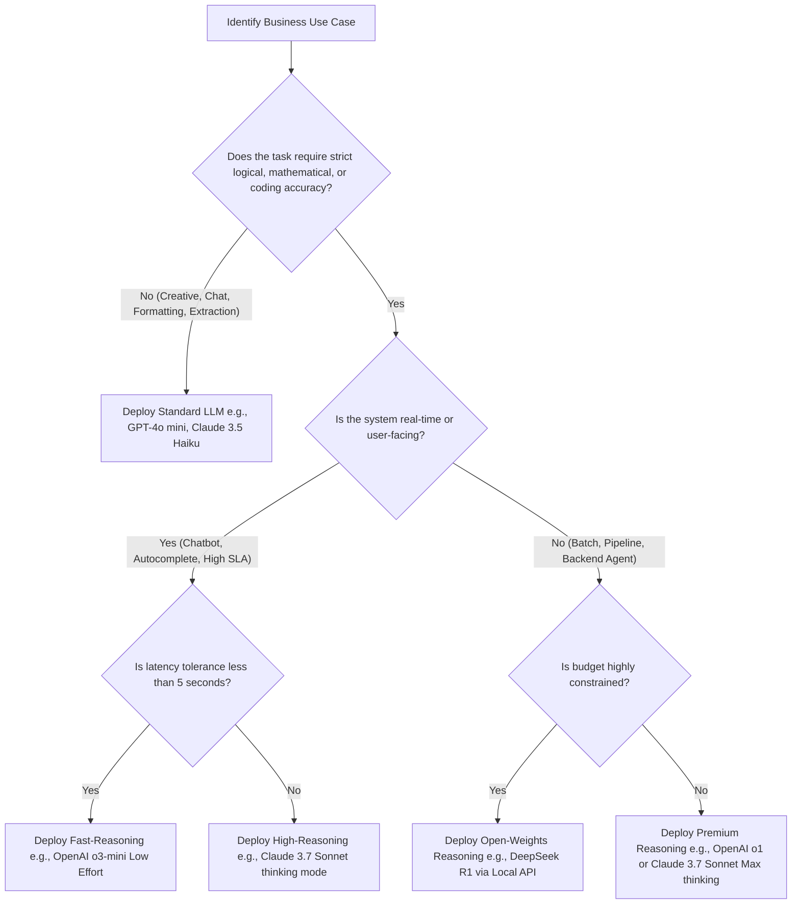

# AI Decision Matrix 2026
*An Executive Reference Guide for CTOs, Engineering Leaders, and Enterprise Strategists*

---

## Executive Summary

As of mid-2026, the enterprise Artificial Intelligence landscape has transitioned from speculative experimentation to structured, returns-driven deployment. Large Language Models (LLMs) are no longer judged solely by general benchmarks; instead, they are evaluated on **total cost of ownership (TCO)**, **architectural predictability**, **latency bounds**, **data sovereignty (compliance)**, and **deterministic reliability**.

### The Current AI Landscape
*   **Reasoning-First Architectures:** The standard "next-token prediction" paradigm has been augmented by reinforcement learning and test-time compute scaling (e.g., OpenAI o1/o3-mini, DeepSeek R1, and Claude 3.7 Sonnet's extended thinking). These models shift computational cost from training time to inference time, delivering high-fidelity reasoning for STEM, logic, and regulatory analysis, albeit at the cost of higher latency and token usage.
*   **The Commodity of Raw Context:** Extremely large context windows (up to 2 million tokens in Gemini 1.5/2.5 Pro) are now standard, fundamentally altering retrieval patterns. Context caching has reduced the TCO of high-volume, long-context inputs by up to 80%, allowing businesses to run multi-document QA and legal review without complex vector search architectures.
*   **Open-Source Parity:** Closed proprietary models no longer hold a monopoly on intelligence. Open-weights models (Meta's Llama 3.1/3.2, Mistral Large, DeepSeek R1) have achieved functional parity in common enterprise tasks, shifting the strategic focus toward self-hosted sovereignty, fine-tuning efficiency, and vendor lock-in prevention.

### Biggest Enterprise Challenges
1.  **The Agentic Cost Gap:** Moving from single-turn chat interfaces to autonomous agentic loops increases token consumption by $10\times$ to $100\times$. Managing loop budgets and preventing runaway executions are primary concerns.
2.  **Sovereignty and Compliance:** The implementation of the **EU AI Act** and the **Indian DPDP Act (2023)** has forced enterprises to mandate strict data residency, zero-data-retention (ZDR) APIs, or full on-premises deployment of open-weights models.
3.  **Inference Latency vs. Reasoning Depth:** For interactive systems (e.g., customer service), reasoning-heavy models are too slow. Engineering teams must design hybrid routing architectures that direct standard queries to "mini" models and route complex issues to reasoning-based systems.

### How to Use This Document
*   **Section 1 & 2** are designed to help choose the specific foundation and coding models.
*   **Section 3** provides the blueprint for agentic workflows and when to pay the latency premium for reasoning models.
*   **Section 4** profiles specialized media and domain-specific systems.
*   **Section 5** acts as the definitive platform selection and TCO calculation framework.

---

## Executive Visual Scorecards
To assist in rapid decision-making, the following tables provide a normalized qualitative score **(1 to 10, where 10 is optimal)** for key enterprise metrics:
*   **Cost:** 10 = Extremely cheap/low TCO; 1 = Prohibitively expensive.
*   **Reasoning:** 10 = Top-tier logic, coding, and mathematical thinking; 1 = Basic retrieval.
*   **Speed:** 10 = Near-instantaneous response; 1 = Slow (e.g., high thinking times).
*   **Privacy:** 10 = Full self-hosting or air-gapped support; 1 = Third-party SaaS with training permissions.
*   **Overall:** Weighted recommendation score for general enterprise workloads.

### Foundation LLMs (Proprietary & Open-Weights)
| Model Family | Cost | Reasoning | Speed | Privacy (Out-of-box) | Overall Enterprise Score |
| :--- | :---: | :---: | :---: | :---: | :---: |
| **OpenAI o1** | 2 | 10 | 3 | 6 | **7.5** |
| **Claude 3.7 Sonnet** | 5 | 9 | 6 | 6 | **8.5** |
| **GPT-4o** | 6 | 8 | 8 | 6 | **8.0** |
| **Gemini 1.5 Pro** | 7 | 8 | 7 | 7 (Vertex AI) | **8.0** |
| **Llama 3.1 405B** | 8 (Self-Host) | 8 | 5 | 10 | **8.5** |
| **Grok 3** | 5 | 8 | 7 | 5 | **7.0** |
| **DeepSeek R1** | 9 (API) | 9.5 | 3 | 10 (Self-Host) | **9.0** |
| **GPT-4o mini** | 9 | 5 | 9 | 6 | **8.0** |
| **Claude 3.5 Haiku** | 8 | 6 | 9 | 6 | **8.0** |
| **Gemini 1.5 Flash** | 9.5 | 5 | 9.5 | 7 (Vertex AI) | **8.5** |

---

## SECTION 1 — Foundation / General Purpose LLMs

### Comparative Specifications Matrix

| Model | Context Window | Input Modalities | API Pricing Tier (per 1M input/output tokens in USD) | Open/Proprietary | Primary Enterprise Target |
| :--- | :---: | :---: | :---: | :---: | :--- |
| **GPT-4o** | 128,000 | Text, Vision, Audio | $2.50 / $10.00 | Proprietary | High-speed multimodal customer interactions |
| **GPT-4o mini** | 128,000 | Text, Vision | $0.15 / $0.60 | Proprietary | Low-latency, high-volume classification/extraction |
| **GPT-4 Turbo** | 128,000 | Text, Vision | $10.00 / $30.00 | Proprietary (Legacy) | Legacy enterprise pipelines |
| **OpenAI o1** | 200,000 | Text, Vision | $15.00 / $60.00 | Proprietary | Academic grade STEM, advanced math, and coding |
| **OpenAI o3-mini** | 200,000 | Text | $1.10 / $4.40 | Proprietary | Cost-effective reasoning, agentic tool selection |
| **OpenAI o4-mini** | 200,000 | Text, Vision | $1.10 / $4.40 (Historical) | Proprietary (Retired) | Succeeded by GPT-5.x class mini models |
| **Claude 3.7 Sonnet** | 200,000 | Text, Vision | $3.00 / $15.00 | Proprietary | General software development and complex analysis |
| **Claude 3.5 Sonnet** | 200,000 | Text, Vision | $3.00 / $15.00 | Proprietary | Legacy workflow support (superseded by 3.7) |
| **Claude 3 Opus** | 200,000 | Text | $15.00 / $75.00 | Proprietary | Creative composition, deep textual comprehension |
| **Claude 3 Haiku** | 200,000 | Text | $0.25 / $1.25 | Proprietary | High-volume batch translation and categorization |
| **Claude 3.5 Haiku** | 200,000 | Text | $0.80 / $4.00 | Proprietary | Ultra-fast tool-calling and lightweight agent loops |
| **Gemini 1.5 Pro** | 2,000,000 | Text, Audio, Video | $1.25 / $5.00 ($2.50 / $10.00 if >128k context) | Proprietary | Mass-document processing, repository understanding |
| **Gemini 1.5 Flash** | 1,000,000 | Text, Audio, Video | $0.075 / $0.30 ($0.15 / $0.60 if >128k context) | Proprietary | Low-cost video and audio analysis |
| **Gemini Ultra** | 32,000 | Text, Vision | Legacy subscription tiers | Proprietary (Legacy) | Replaced by Gemini 1.5/2.5 Pro architectures |
| **Gemini Nano** | Local (Device) | Text | On-device execution (No API fee) | Proprietary | Edge compute, offline client-side parsing |
| **Llama 3 (70B)** | 8,000 | Text | $0.59 / $0.79 (Average Host) | Open Weights | Legacy on-premises deployments |
| **Llama 3.1 (405B)** | 128,000 | Text | $2.66 / $8.00 (API) / Self-Host | Open Weights | Enterprise sovereign model, private fine-tuning |
| **Llama 3.2 (3B)** | 128,000 | Text | $0.06 / $0.18 (API) / Self-Host | Open Weights | Edge processing, mobile deployments |
| **Mistral 7B** | 32,000 | Text | Self-Host / $0.20 / $0.20 | Open Weights | Edge and local text operations |
| **Mistral Large** | 128,000 | Text | $2.00 / $6.00 | Proprietary API | European sovereign hosting, EU compliance |
| **Mixtral 8x7B** | 32,000 | Text | Self-Host / $0.50 / $0.50 | Open Weights | High-speed open MoE text classification |
| **Codestral** | 32,000 | Text | $1.00 / $3.00 | Open Weights (Non-comm) | Local code generation and repository parsing |
| **Grok 1** | 8,192 | Text | Open weights (Self-Host) | Open Weights (Legacy) | Legacy xAI showcase |
| **Grok 2** | 131,072 | Text, Vision | $2.00 / $10.00 | Proprietary API | Real-time social content generation and search |
| **Grok 3** | 131,072 | Text, Vision | $3.00 / $15.00 | Proprietary API | Advanced search and real-time reasoning |

---

### Detailed Vendor Profiles & Strategic Suitability

#### 1. OpenAI (o1, o3-mini, GPT-4o, GPT-4o mini)
OpenAI remains the industry benchmark for developer ecosystem size and tooling maturity.
*   **Key Strengths:** Best-in-class reasoning speeds with `o3-mini`. The JSON mode and Structured Outputs (`response_format`) are highly reliable for downstream pipeline integrations.
*   **Critical Weaknesses:** High cost variability due to hidden reasoning tokens in the `o1` family. Frequent rate limit fluctuations during peak hours.
*   **Enterprise Suitability:** **High**. Robust enterprise security via Azure OpenAI (guaranteeing zero data training).

#### 2. Anthropic (Claude 3.7 Sonnet, Claude 3.5 Haiku, Claude 3 Opus)
Anthropic has positioned itself as the consulting community's favorite due to its superior text composition and safety alignments.
*   **Key Strengths:** Claude 3.7 Sonnet's "extended thinking" allows developers to set execution ceilings (e.g., maximum budget limits) on reasoning. Outstanding performance in software development, data extraction from PDFs, and academic writing.
*   **Critical Weaknesses:** Claude 3.5 Haiku is priced significantly higher than its direct competitors (GPT-4o mini and Gemini 1.5 Flash), offering a poor cost-to-performance ratio for raw throughput.
*   **Enterprise Suitability:** **High**. The AWS Bedrock integration makes it the default choice for enterprises requiring AWS security controls.

#### 3. Google (Gemini 1.5 Pro, 1.5 Flash, Gemini Nano)
Google’s strategy leverages native multimodality (ingesting audio, video, and text directly) and massive context.
*   **Key Strengths:** 2-million-token context window with native **Context Caching**. A developer can cache a 1.5-million-token documentation corpus and execute rapid queries for a fraction of the normal cost. Direct video file analysis (up to 1 hour of video).
*   **Critical Weaknesses:** Higher latency for initial tokens (TTFT) on long context sizes. Performance degradation ("needle-in-a-haystack" retrieval failure) when approaching the maximum 2M limit without structured prompts.
*   **Enterprise Suitability:** **High**. Vertex AI provides complete data isolation and sovereignty compliance under Google Cloud's security framework.

#### 4. Meta (Llama 3.1 & 3.2 Series)
Meta's open-weights models are the bedrock of local/sovereign AI operations.
*   **Key Strengths:** Complete independence from third-party vendor APIs. Llama 3.1 405B is highly capable of distillation, allowing enterprises to train smaller, specialized in-house models. Llama 3.2 3B is highly optimized for mobile devices and local client deployments.
*   **Critical Weaknesses:** Large models require substantial hardware investments. Running Llama 3.1 405B at scale requires multiple high-end enterprise GPUs (e.g., 8x H100s).
*   **Enterprise Suitability:** **Very High** (specifically for highly regulated fields like banking, defense, and healthcare where cloud APIs are restricted).

#### 5. Mistral (Mistral Large, Codestral, Mixtral)
Mistral AI provides a bridge between open-source models and proprietary performance, tailored heavily for European compliance.
*   **Key Strengths:** High MoE (Mixture of Experts) efficiency. Strong native multilingual capabilities across French, German, Spanish, and Italian.
*   **Critical Weaknesses:** Developer ecosystem and SDK quality lag behind OpenAI and Anthropic.
*   **Enterprise Suitability:** **Medium-High**. The default choice for European corporations requiring localization and strict adherence to EU GDPR.

#### 6. xAI (Grok 2, Grok 3)
xAI relies heavily on real-time data access through the X platform.
*   **Key Strengths:** Grok 3 features high-fidelity reasoning and real-time knowledge retrieval. Excellent coding and math benchmarks.
*   **Critical Weaknesses:** Minimal enterprise tooling integration compared to competitors. High volatility of corporate ownership.
*   **Enterprise Suitability:** **Low-Medium**. Best suited for social media analytics, public opinion tracking, and consumer-facing applications.

---

## SECTION 2 — Code Models

### Coding Model Comparison Matrix

| Model / System | Primary Coding Strengths | Supported Languages | Native IDE Integrations | Hosting Model | IP Indemnification / Compliance |
| :--- | :--- | :--- | :--- | :--- | :--- |
| **GitHub Copilot** | Inline autocomplete, repository-wide indexing, conversational debugging | All major languages (Python, JS, TS, Go, Java, C++, Rust) | VS Code, Visual Studio, JetBrains, Neovim | SaaS (Microsoft Azure backend) | Yes (Commercial customers protected against public code duplication) |
| **Codestral** | High fill-in-the-middle accuracy, multi-language repository understanding | 80+ languages (optimized for Python, C++, TS, Java, PHP) | VS Code, JetBrains | API / Self-Host (Custom weights license) | None (Community version); Basic on paid cloud endpoints |
| **Code Llama** | Code-focused generation, instruction following, inline infilling | Python, C++, Java, PHP, C#, Bash, JS | VS Code (via extensions), Neovim | Self-Host (Open weights) | None |
| **StarCoder 2** | Custom pre-training target, highly auditable training corpus, clean licensing | 600+ languages | VS Code, Neovim, Emacs | Self-Host (Open weights, permissive license) | Strong (Trained on Stack v2 with strict opt-out compliance) |
| **DeepSeek Coder V2** | Leading benchmark performance, math/logic coding, complex syntax construction | 300+ languages | VS Code (via extensions) | API / Self-Host (Open weights) | None |
| **Amazon Q Developer** | Legacy codebase migration, AWS service integration, security vulnerability scanning | Java, Python, JS, TS, C#, Go | VS Code, JetBrains, AWS Console | SaaS (AWS hosted) | Yes (AWS Enterprise Indemnification) |

---

### Key Enterprise Considerations for Code Models

#### 1. Self-Hosting vs. SaaS
*   **SaaS (GitHub Copilot, Amazon Q Developer):**
    *   *Pros:* Zero infrastructure overhead; continuous model updates; advanced codebase indexing (SaaS-managed vector database).
    *   *Cons:* Codebase metadata and code blocks must be transmitted to external servers. High dependency on outbound internet connectivity.
*   **Self-Hosted (StarCoder 2, DeepSeek Coder V2, Codestral):**
    *   *Pros:* Complete IP isolation (runs within an air-gapped VPC). No outbound telemetry. Customized fine-tuning on internal proprietary frameworks.
    *   *Cons:* Requires dedicated GPU clusters (e.g., NVIDIA A10G/L40S). Higher initial setup and maintenance costs.

#### 2. Intellectual Property (IP) and Licensing Risks
*   **Copyleft Contamination:** Standard generative code models can occasionally output code snippets identical to GPL-licensed public repositories. Using such snippets in commercial applications can violate licenses.
*   **Indemnification Protection:** Premium platforms like GitHub Copilot Enterprise and Amazon Q Developer offer **IP Indemnification**, promising to defend and indemnify commercial users if the model-generated code is accused of copyright infringement. This is a critical requirement for enterprise legal departments.
*   **Auditable Corpora:** StarCoder 2's dataset is fully documented, allowing enterprise compliance officers to verify that the training data contains no unauthorized copyleft or proprietary materials.

#### 3. Privacy Implications
*   **Telemetry Opt-Out:** In all enterprise SaaS tiers, the configuration must explicitly disable "use data for model improvement." Standard consumer tiers often opt-in by default, exposing private corporate APIs and security tokens to the model provider.
*   **Local Inference Gateway:** Best practice dictates routing all code queries through a central internal proxy (e.g., LiteLLM or an enterprise API gateway) to scan inputs for API keys, secrets, and customer personally identifiable information (PII) before transmission.

---

## SECTION 3 — Reasoning & Agentic Models

### Reasoning vs. Standard LLMs: Architectural Divergence
Standard LLMs use next-token prediction, generating responses inline as fast as possible. Reasoning models use a dynamic **Chain-of-Thought (CoT)** loop before returning the final response.

```
Standard LLM:   [Input Prompt] ──────────────────────────────────────────> [Instant Output Tokens]
Reasoning LLM:  [Input Prompt] ──> [Internal RL/CoT Loops (Thinking)] ──> [Synthesized Output Tokens]
```

*   **Reinforcement Learning (RL) Optimization:** Reasoning models (like DeepSeek R1 and OpenAI o1) are trained using RL techniques that reward the model for correcting its own mistakes, planning multi-step actions, and trying alternative strategies when blocked.
*   **Test-Time Compute Scaling:** Instead of dedicating all compute to training, these models scale compute during inference. The longer the model is allowed to "think" (or the higher the reasoning effort selected), the higher the quality of the reasoning output.
*   **Hidden Billed Tokens:** During the thinking phase, the model generates thousands of internal reasoning tokens. While invisible to the end user, these tokens still count against the model's total context limit and are billed at the full output token rate.

---

### Decision Flow Diagram: Reasoning Model Activation


---

### Agentic Frameworks: Architectural Comparison

| Framework | Core Design Paradigm | Best Enterprise Use Case | Limitations / Trade-offs |
| :--- | :--- | :--- | :--- |
| **LangGraph** | Stateful, multi-agent orchestration via directed graphs. Cycle-tolerant and deterministic. | Human-in-the-loop workflows, predictable customer support routing, multi-step document generation. | Steep learning curve; requires explicit manual definition of graph nodes and edges. |
| **CrewAI** | Role-playing, task-oriented agent collaboration. Simulates real team structures. | Fast prototyping of collaborative tasks, automated content writing, competitor market analysis. | High token overhead due to extensive agent-to-agent negotiation prompts; prone to infinite loops. |
| **AutoGPT** | Autonomous single-agent execution loops with file and web tool access. | Open-ended research, automated web-scraping, background file sorting. | Highly unpredictable; easily distracted; high cost without strict termination boundaries. |

#### Function Calling & Tool Use: Best Practices
*   **Deterministic Schemas:** Define functions with rigid JSON schemas. Ensure that variables are typed explicitly (e.g., forcing a strict string enum instead of an open-ended string).
*   **Sandboxing:** Any tool that allows python code execution or database writes must be executed inside an isolated sandbox (e.g., AWS Lambda, gVisor, or a Docker container) with zero network access to the primary corporate network.
*   **Structured Outputs Force:** Force the model to output tools via a dedicated API block rather than hoping it formats text properly. Always build a robust validation parser to catch malformed arguments before execution.

---

## SECTION 4 — Multimodal & Specialized Models

### Media Generation Models

| Category | Model / System | Quality Benchmark | Commercial Rights / Compliance | Enterprise Adoption Level | Primary Limitations |
| :--- | :--- | :--- | :--- | :--- | :--- |
| **Image** | **DALL-E 3** | High styling consistency, excellent prompt following. | Permissive (Users own outputs; OpenAI offers IP indemnity). | High (Integrated into Microsoft Office & Azure). | Lacks fine-grained control; tends to look overly "AI-generated." |
| **Image** | **Stable Diffusion 3 / Flux** | Photorealistic, outstanding text rendering within images. | Requires commercial licensing for Flux Pro / SD commercial tier. | High (Self-hosted image generation pipelines). | Requires extensive prompt-engineering and high GPU VRAM. |
| **Image** | **Midjourney v6** | Industry leader in aesthetic quality, realism, and design. | Allowed for commercial use (on paid membership tiers). | Low-Medium (Lacks developer API access). | Closed ecosystem, API access must be proxied via unofficial providers. |
| **Image** | **Ideogram 2** | Industry-leading text layout and typography rendering. | Permissive (Paid subscriptions allow commercial rights). | Medium (Design departments for marketing collateral). | Limited styling breadth compared to Midjourney. |
| **Audio** | **Whisper (v3)** | Gold standard for speech-to-text accuracy and multilingual. | Open-source (MIT License). Fully permissible. | Very High (Default for transcription pipelines). | Prone to hallucinating repeating loops during extended silences. |
| **Audio** | **ElevenLabs** | State-of-the-art voice synthesis, cloning, and emotional range. | Permissive (Ownership depends on plan; strict terms of service). | High (Audiobook production, localized corporate training). | High cost per character; risk of deepfake abuse. |
| **Audio** | **Suno & Udio** | Best-in-class generative music, lyrics, and instrumentals. | Permissive (Paid plans grant ownership; copyrights are complex). | Low (Marketing and localized campaign creation). | Complex copyright landscapes; pending litigation from music labels. |
| **Video** | **Sora** | Hyper-realistic physical simulation, consistency over 60s. | Heavily restricted; managed access. | Low-Medium (Limited release, high compliance screening). | Extremely long rendering latency; high computing costs. |
| **Video** | **Runway Gen-3** | Premium motion control, cinematic quality, fast generation. | Permissive (Paid commercial tiers). | Medium (Advertising agencies and production houses). | Inconsistencies with complex physics and hand movements. |
| **Video** | **Kling AI** | Outstanding body movement physics, long durations. | Permissive (Paid tiers). | Medium (Fast social video production). | Visual artifacts in high-motion sequences. |

---

### Vision Models (LLM Integration)
*   **GPT-4o Vision:** Best for chart/graph parsing, data extraction from complex schemas, and OCR of hand-written notes.
*   **Claude 3.7 Sonnet Vision:** Highest precision in technical drawing transcription, structural layouts, and software mockups translation into code.
*   **Gemini 1.5/2.5 Pro Vision:** Industry leader in long-video parsing (handling files >100MB directly) and raw audio transcript extraction.

---

### Text Embeddings Comparison

| Model | Dimensions | Max Input Tokens | Cost per 1M Tokens | Unique Feature / Enterprise Advantage |
| :--- | :--- | :--- | :--- | :--- |
| **text-embedding-3-large** | Up to 3,072 | 8,191 | $0.13 | **Matryoshka Representation:** Allows reducing dimensions (down to 256) without significant accuracy loss to save database storage costs. |
| **Cohere Embed v3** | Up to 1,024 | 512 | $0.10 | **Search-Optimized:** Includes a built-in search intent parameter (e.g., query vs. document) that dramatically improves retrieval accuracy. |
| **BGE-M3** | 1,024 | 8,192 | Self-Host (Free) | **Multi-Functionality:** Supports dense retrieval, sparse retrieval (lexical matching), and multi-vector search simultaneously. |

---

### Domain-Specific Models
*   **Med-PaLM / Med-Gemini:** Google's specialized clinical models. Used for healthcare workflow analysis, medical record summarization, and clinical QA. Highly compliant with HIPAA structures but strictly restricted to secure cloud silos.
*   **BloombergGPT:** 50-billion-parameter model optimized for financial tasks. Outperforms generic models on financial sentiment analysis and credit risk reporting. However, standard LLMs (like GPT-4o) with financial data RAG pipelines have mostly displaced it due to better API accessibility.
*   **Legal AI Systems (Harvey / CoCounsel):** Highly tuned legal reasoning wrappers built on proprietary models (e.g., GPT-4 customization). Used for document review, contract reconciliation, and legal research. They include built-in audit trails and strict non-hallucination guardrails to ensure court compliance.

---

## SECTION 5 — Enterprise AI Platforms & Decision Framework

### Platform Selection Matrix

| Metric | AWS Bedrock | Azure OpenAI | Google Vertex AI | Hugging Face Enterprise |
| :--- | :--- | :--- | :--- | :--- |
| **Core Models Available** | Anthropic Claude, Mistral, Llama, Cohere, AI21 | OpenAI (GPT-4o, o1, o3-mini) exclusively | Gemini models, Llama, Mistral | Thousands of open-weights models (Llama, DeepSeek, Qwen) |
| **Data Privacy & residency** | Data stays in customer's AWS VPC. Multi-region redundancy. | Strict Azure security. Zero-data-retention (ZDR) options for HIPAA. | Vertex AI sovereign cloud options, strict Google GCP boundary. | Runs in private VPC or dedicated hardware spaces. |
| **Compliance Profiles** | HIPAA, SOC 2, ISO 27001, FedRAMP High | HIPAA, SOC 2, FedRAMP, GDPR, HITRUST | HIPAA, SOC 2, EU AI Act ready, FedRAMP | Fully dependent on deployment architecture. |
| **Customization Options** | Fine-tuning, custom models, prompt management. | Fine-tuning (on specific models), provisioned throughput. | Vertex AI Studio, fine-tuning, adapter tuning, RLHF. | Full model training, fine-tuning, hosting, and merging. |
| **Vendor Lock-in Risk** | Low (allows switching underlying model providers instantly). | High (tied directly to Microsoft Azure ecosystem). | Medium-High (tied to Google Cloud platform tools). | Very Low (open-source weights can be ported anywhere). |
| **Pricing Models** | Pay-as-you-go per token, provisioned throughput. | Pay-as-you-go, Provisioned Throughput Units (PTU). | Pay-as-you-go, context-caching pricing, node-based pricing. | Dedicated hardware instance hourly fees (GPU-based). |

---

### Open-Source vs. Proprietary Trade-offs

| Strategic Dimension | Open-Source / Open-Weights (e.g., Llama 3.1, DeepSeek R1) | Proprietary SaaS (e.g., OpenAI, Anthropic Claude) |
| :--- | :--- | :--- |
| **Total Cost of Ownership (TCO)** | High initial capital expenditure (GPU procurement, cluster hosting). Very low incremental cost per token. | Zero setup cost. High recurring token costs that scale linearly with volume. |
| **Data Privacy & Residency** | **Absolute Control.** Can run in an air-gapped, on-premise datacenter with zero data leakage. | Requires trust in SaaS vendors. Subject to subpoena laws, cloud data transfer limits. |
| **Compliance & Sovereignty** | Simplifies local audits; no third-party data processing agreements (DPA) required. | Complex DPA required. Must audit data residency across multi-tenant regions. |
| **Customization & Fine-Tuning** | **Full Access.** Allows deep weights adjustment, parameter-efficient fine-tuning (LoRA), and model merging. | Restricted to vendor-provided API fine-tuning interfaces. Custom base weights are inaccessible. |
| **Vendor Lock-in** | Zero. Models can be moved between AWS, GCP, local hardware, or RunPod. | High. Migration requires refactoring system prompt patterns, APIs, and SDKs. |
| **Operational Complexity** | High. Requires Kubernetes orchestration (vLLM, Triton), monitoring, and GPU hardware management. | Minimal. Standard REST API integration. |

---

### TCO Comparison: Cost per 1 Million Tokens (USD)
*Note: Pricing is averaged as of mid-2026 across major API providers.*

| Model | Input Price / 1M Tokens | Output Price / 1M Tokens | Estimated Cost for 1,000 Complex Agentic Runs (10k Input / 2k Output per run) |
| :--- | :---: | :---: | :---: |
| **OpenAI o1** | $15.00 | $60.00 | $270.00 |
| **Claude 3.7 Sonnet** | $3.00 | $15.00 | $60.00 |
| **GPT-4o** | $2.50 | $10.00 | $45.00 |
| **Gemini 1.5 Pro** | $1.25 | $5.00 | $22.50 |
| **OpenAI o3-mini** | $1.10 | $4.40 | $19.80 |
| **Claude 3.5 Haiku** | $0.80 | $4.00 | $16.00 |
| **Llama 3.1 70B (Hosted)**| $0.60 | $0.80 | $7.60 |
| **DeepSeek R1 (API)** | $0.55 | $2.19 | $9.88 |
| **GPT-4o mini** | $0.15 | $0.60 | $2.70 |
| **Gemini 1.5 Flash** | $0.075 | $0.30 | $1.35 |

---

### Architectural Alternatives: Prompting vs. RAG vs. Fine-Tuning

```
Complexity:    [Prompt Engineering]  ────>  [Retrieval-Augmented Generation]  ────>  [Fine-Tuning / Distillation]
Data Demand:   Zero External Data          Dynamic Context Injection                 Static Model Weights Update
Latency:       Low                         Medium (Search Overhead)                 Low
```

#### 1. Prompt Engineering
*   **When to Use:** Fast prototyping, generic task definition, style formatting, simple classifications.
*   **Trade-offs:** High token usage per call, strict limit on context length, vulnerable to prompt injection attacks.
*   **Example:** Forcing a model to output data strictly as a Markdown table.

#### 2. Retrieval-Augmented Generation (RAG)
*   **When to Use:** Dynamic databases, customer support bots pulling from wikis, legal research on live files, system policies updates.
*   **Trade-offs:** Relies heavily on retrieval quality (semantic search/chunks), introduces search latency.
*   **Example:** A HR chatbot referencing the current year's internal healthcare benefits PDF.

#### 3. Fine-Tuning
*   **When to Use:** Forcing strict style patterns, teaching custom code syntax, training on proprietary domain vocabulary, reducing latency/token size.
*   **Trade-offs:** High training data curation cost, risk of catastrophic forgetting, expensive GPU training runs.
*   **Example:** Training a 7B model to output SQL queries matching a complex, proprietary database schema.

---

### Model Selection Selection Framework (10 Real-World Use Cases)

| Use Case | Recommended Model | Why | Alternative |
| :--- | :--- | :--- | :--- |
| **1. Customer support chatbot** | **Gemini 1.5 Flash** (via Vertex AI) | Ultra-low cost, high speed, and native support for multilingual audio input, lowering voice latency. | **GPT-4o mini** (Alternative for text-only systems with low-latency APIs). |
| **2. Legal document review** | **Claude 3.7 Sonnet** (Thinking Mode) | Superior textual logic, high accuracy in legal extraction, and strict safety alignments preventing over-extrapolation. | **Gemini 1.5 Pro** (Alternative if processing files > 1,000 pages due to 2M context window). |
| **3. Code review & automation** | **Claude 3.7 Sonnet** | Best-in-class multi-file code understanding, software design pattern consistency, and refactoring logic. | **GitHub Copilot Enterprise** (Alternative for direct developer editor integration). |
| **4. RAG search over corporate wikis** | **Llama 3.1 70B** (Hosted Locally) | Complete data isolation for private documents, excellent retrieval alignment, and cost-effective high-volume querying. | **GPT-4o** (Alternative via Azure OpenAI for rapid cloud setup). |
| **5. Complex mathematical logic**| **OpenAI o1** | Leads reasoning benchmarks; utilizes internal reinforcement learning to solve complex computational queries. | **DeepSeek R1** (Alternative for open-weights hosting with comparable accuracy). |
| **6. OCR & complex document extraction** | **GPT-4o** | Excellent vision processing layer; extracts tabular data from structured PDFs and handwritten scans accurately. | **Claude 3.7 Sonnet** (Alternative if tables require deep logical reconciliation). |
| **7. Training content generation** | **Claude 3.5 Sonnet** (or Claude 3 Opus) | Outstanding creative composition; generates engaging, non-repetitive prose for corporate learning platforms. | **GPT-4o** (Alternative for high-speed multi-language learning modules). |
| **8. High-volume audio transcription** | **Whisper v3** (Self-Hosted) | Best-in-class speech-to-text accuracy; support for 90+ languages; open-source (no transaction cost). | **ElevenLabs** (Alternative if voice cloning/playback is also required). |
| **9. Real-time financial analysis** | **Claude 3.7 Sonnet** | Flawless handling of tabular data extraction, numerical consistency checks, and economic report summarization. | **Llama 3.1 405B** (Alternative for private on-premises hedge-fund deployments). |
| **10. Internal AI assistant** | **GPT-4o mini** | Balanced intelligence, low latency, and highly cost-effective for generic daily utility tasks. | **Llama 3.2 3B** (Alternative for local device desktop deployment). |

---

## Key Takeaways: 5 Enterprise Lessons

1.  **No Single Best Model Exists:** The modern enterprise architecture is **multi-model**. Companies must route tasks dynamically: low-complexity extraction to `GPT-4o mini` / `Gemini Flash`, and high-complexity logic to `Claude 3.7 Sonnet` or reasoning models like `o3-mini`.
2.  **Open-Source is Not Always Cheaper:** While open-weights models eliminate token licensing fees, they shift the burden to infrastructure. Running large models (e.g., Llama 3.1 405B) requires dedicated GPU orchestration, making proprietary APIs cheaper for low-to-medium volume workloads.
3.  **RAG Beats Fine-Tuning More Often Than Expected:** Fine-tuning is a poor way to teach models facts. For 90% of enterprise information retrieval tasks, a robust semantic hybrid search pipeline (RAG) is faster to deploy, easier to audit, and cheaper to maintain than a fine-tuned model.
4.  **Reasoning Models are Costly but Powerful:** Test-time compute scaling (e.g., `o1`, `R1`) is highly effective for code generation, mathematical models, and safety checks, but it introduces a latency tax. Use them behind asynchronous queues or for non-interactive pipelines.
5.  **Governance Matters as Much as Accuracy:** A model with 98% accuracy is useless if it violates regional residency laws. Enterprise deployment architectures must prioritize zero-data-retention endpoints, prompt guardrails, and compliance tracking over raw benchmark performance.
