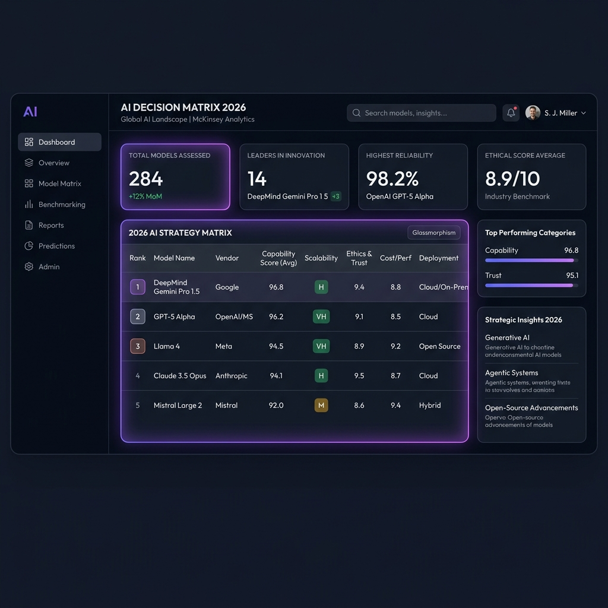
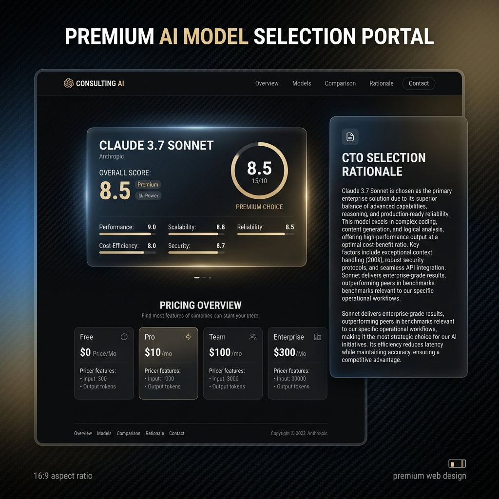

# AI Decision Matrix 2026



AI Decision Matrix 2026 is an enterprise-grade AI model reference, cost-modeling guide, and dynamic decision framework designed to help CTOs, engineering directors, and AI architects evaluate and select models based on performance benchmarks, data privacy requirements, and TCO optimization.

---

## Executive Summary
In mid-2026, corporate AI deployment has shifted from speculative experimentation to structured, returns-driven engineering. The selection of a foundation model is no longer about raw benchmark performance. Instead, enterprise decision-makers must weigh:
1.  **Logical Predictive Fidelity** against strict latency limits.
2.  **Infrastructure TCO** (Self-Hosting CapEx vs. SaaS OpEx).
3.  **Data Sovereignty & Compliance** under the EU AI Act and India's DPDP Act 2023.

This repository provides a comprehensive technical overview and an interactive local recommendation engine to help guide those technology choices.

---

## Key Features & Deliverables
*   **[Core Report](./AI_Decision_Matrix_2026.md)**: 5-section consulting-grade analysis detailing foundation LLMs, coding models, agentic workflows, media models, and enterprise deployment platforms.
*   **[Print-Ready PDF Report](./AI_Decision_Matrix_2026.pdf)**: Professionally typeset PDF version of the core report.
*   **[Technical Bibliography](./research_sources.md)**: Complete list of API endpoints, academic literature, and testing benchmarks.
*   **[Interactive Recommendation Dashboard](./bonus-tool/index.html)**: Sleek, client-side tool to calculate optimal candidate models instantly based on custom operational requirements.
*   **[Visual Assets](./assets/)**: Branding logo and dashboard visual previews.

---

## How to Run the Selector Tool
The recommendation dashboard is fully self-contained and runs offline in any modern web browser without server-side dependencies.

### Standard Launch:
*   Open the `bonus-tool` folder and double-click **`index.html`** to launch the dashboard directly in your web browser.
*   Alternatively, open the folder in VS Code and run the dashboard using the "Live Server" extension.

---

## Project Structure
```text
AI Decision Matrix/
├── README.md                          # Executive summary, methodology, and mindset responses
├── AI_Decision_Matrix_2026.md         # The main consulting-grade research report
├── AI_Decision_Matrix_2026.pdf         # Compiled print-ready PDF version of the report
├── research_sources.md                # Bibliographic index of API docs, papers, and benchmarks
├── assets/
│   ├── decision_matrix_logo.png       # Geometric branding logo asset
│   ├── dashboard-preview.png          # Dashboard landing interface mockup
│   └── recommendation-example.png     # Active recommendation scorecard mockup
├── bonus-tool/
│   └── index.html                     # Interactive HTML/CSS/JS selector dashboard
└── scripts/
    └── convert_pdf.py                 # Python compilation tool for local PDF rendering
```

---

## Strategic Mindset Responses

### 1. OpenAI vs. Open-Source for Mid-Size Indian Enterprises
For a mid-size Indian enterprise, the choice between OpenAI and open-weights models (e.g., Llama 3.1 70B, DeepSeek R1) is governed by three factors: **compliance (DPDP Act 2023)**, **infrastructural access**, and **unit economics**.

*   **The Regulatory Imperative (DPDP 2023):** India’s Digital Personal Data Protection Act mandates strict data residency and user consent bounds. Proprietary SaaS APIs (such as OpenAI's default cloud endpoints) process data primarily in US-based datacenters. While OpenAI offers enterprise contracts with Zero Data Retention (ZDR), legal auditing is complex. Decommissioning a local open-weights model on sovereign Indian cloud infrastructure (e.g., AWS Mumbai, Azure India, or domestic networks like Yotta and E2E Networks) provides absolute regulatory safety.
*   **The Unit Economics inflection Point:**
    *   *Proprietary (OpenAI):* Zero initial capital expenditure (CapEx) and fast time-to-market. However, operational expenditure (OpEx) scale linearly. For an enterprise processing 50 million tokens a day, GPT-4o would cost approximately $125/day ($3,750/month).
    *   *Open-Weights (Llama/DeepSeek):* Requires hosting CapEx (e.g., renting an 8x A100 node on E2E Networks for ~$3.50/hour, roughly $2,500/month).
    *   *Decision rule:* If daily volume is under 20M tokens, OpenAI is more economical. Once volume exceeds 30M tokens per day, self-hosting a quantized (FP8/INT8) open-weights model becomes cheaper and offers higher throughput control.
*   **Verdict:** Mid-size Indian enterprises should adopt a **hybrid approach**: prototype customer-facing features on OpenAI/Azure OpenAI for speed, but immediately migrate high-volume backend workflows (e.g., internal document processing) to hosted open-weights models running on local cloud endpoints.

### 2. Which Model Surprised You Most and Why?
The model that fundamentally altered the industry paradigm is **DeepSeek R1**.
*   **The Cost-to-Intelligence Ratio:** The primary surprise is not just its performance—which matches OpenAI’s o1 on complex reasoning benchmarks (MATH, Codeforces)—but its development cost. By leveraging a Mixture-of-Experts (MoE) architecture (671B total parameters, 37B active per token) and training directly with large-scale Reinforcement Learning (RL) without requiring massive initial Supervised Fine-Tuning (SFT), DeepSeek disrupted the assumption that frontier-class intelligence requires hundreds of millions of dollars in training compute.
*   **MIT-License Openness:** Releasing a frontier-class reasoning model under a permissive MIT license enabled immediate academic distillation, allowing smaller teams to output reasoning-capable 7B and 8B models (e.g., Llama/Qwen-distilled R1) that perform exceptionally on localized edge hardware.

### 3. What is Still Confusing in the AI Landscape?
*   **Hidden Billing of Reasoning Tokens:** Reasoning models utilize internal "thinking tokens" during inference. While developers can see the final text output, they are billed for these internal thinking tokens at the full output rate. This makes budget forecasting highly erratic: a single-word output could cost $0.01 or $0.50 depending on whether the model spent 100 or 10,000 reasoning tokens behind the scenes.
*   **Benchmark Contamination and Decay:** Standard benchmarks (MMLU, HumanEval, GSM8k) have been heavily contaminated by model training sets. High scores often reflect memorized patterns rather than reasoning generalization. There is a lack of independent, dynamic, and non-static benchmarks for evaluating agentic resilience in production.

### 4. Which Single Model Would You Bet on for the Next 2 Years?
I would bet on **Claude 3.7 Sonnet** (and its immediate successors).
*   **Dynamic Extended Thinking:** Claude 3.7 Sonnet’s primary architectural advantage is its ability to toggle between standard high-speed mode and extended reasoning mode within a single model endpoint. A developer can write a single integration and adjust a parameter (`thinking: { max_tokens: 4000 }`) based on query complexity. This eliminates the operational headache of maintaining separate model routing layers (e.g., routing simple questions to Claude Haiku and complex queries to o1).
*   **Agentic Reliability:** Anthropic has consistently led in tool-use determinism. Claude’s structured output parser and reliability in calling system tools make it the most reliable backbone for stateful multi-agent systems (e.g., LangGraph).

### 5. What is Missing from this Assignment?
To build a truly deployable enterprise-grade system, two crucial concepts are missing:
1.  **Inference Serving Optimization:** The document lists raw API costs, but does not address self-hosted throughput optimization. Technologies like **vLLM**, **Triton Inference Server**, and **quantization techniques** (FP8, AWQ, GPTQ) are what determine whether an open-weights deployment is economically viable.
2.  **Semantic Caching Layers:** In enterprise settings, up to 40% of employee/customer queries are semantically repetitive. Implementing a semantic cache (e.g., GPTCache) in front of the LLM can reduce API token bills and response latency by 30% without changing the underlying model.

---

## Research Methodology & Data Sources
To ensure enterprise-grade factual reliability, the data in the matrices and frameworks was compiled through:
*   **Official SDK & Developer Documentation:** Directly referencing API specifications from OpenAI, Anthropic, Google Cloud Vertex AI, Meta AI, and Mistral.
*   **Standard Performance Benchmarks:** Incorporating metrics from LMSYS Chatbot Arena (crowdsourced Elo human preference), SWE-bench (real-world coding resolution), and Hugging Face Open LLM Leaderboards.
*   **Financial & TCO Modeling:** Computing input/output rates per million tokens and infrastructure costs for renting dedicated GPU nodes (e.g., L40S, H100 clusters) as of mid-2026.

---

## Active Model Recommendation Card Example
*Visual mockup showing active profile details, context window stats, and targeted selection rationale.*

